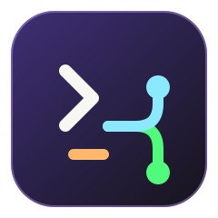

<div align="center">



# LazyGit Enhanced Configuration

### Deliberate Git workflows, with AI where it earns its place.

Turn staged changes into polished commits and branch names. Review pull requests through focused, three-pass analysis. Keep every suggestion under human control.

[Quick Start](#quick-start) · [Install](#installation) · [PR Review](#ai-pr-review-ctrla-or-pr-review) · [Configuration](#configuration)

</div>

> [!TIP]
> Built for developers who want a fast terminal workflow without giving up review quality, clear history, or control over what gets posted.

## A Better Git Loop

| Review with context | Commit with intent |
|---|---|
| Run focused checks for architecture, security, bugs, performance, tests, spelling, and resolved feedback. | Generate a conventional commit message from staged changes, then review or edit it before committing. |
| Every PR analysis runs three passes to improve signal and filter false positives. | Generate a descriptive, kebab-case branch name from the same staged context. |

| Choose your AI | Keep the final call |
|---|---|
| Use GitHub Copilot, Cursor Agent, or OpenAI Codex. Provider, model lists, prompts, retries, and timeouts live in `settings.yaml`. | Inspect every suggestion, edit it in your preferred editor, post comments selectively, and resolve validated review threads without deleting history. |

## What It Includes

- **Three-pass PR review**: architecture, security, code quality, test coverage, performance, bugs, spelling, and fix validation.
- **Precise collaboration**: inline review comments target the relevant diff line; validated fixes resolve the existing review thread.
- **Terminal-native interface**: structured panels, fuzzy pickers, optional context, and a Dracula-themed LazyGit setup.
- **Provider gateway**: a modular adapter layer makes it straightforward to switch or extend AI providers.
- **Per-repository authentication**: automatically selects the appropriate GitHub account from local configuration or the active `gh` session.

---

## Prerequisites

### Required

| Dependency | Purpose | Install |
|---|---|---|
| [LazyGit](https://github.com/jesseduffield/lazygit) | Terminal UI for git | `brew install lazygit` |
| [git-delta](https://github.com/dandavison/delta) | Syntax-highlighted diffs | `brew install git-delta` |
| [fzf](https://github.com/junegunn/fzf) | Interactive fuzzy selection menus | `brew install fzf` |
| [jq](https://jqlang.github.io/jq/) | JSON parsing for PR data | `brew install jq` |
| [yq](https://mikefarah.gitbook.io/yq/) | YAML configuration and runtime state | `brew install yq` |
| curl | Azure DevOps REST API calls | pre-installed on macOS |
| [gh](https://cli.github.com/) | GitHub CLI (required for GitHub remotes) | `brew install gh` |
| Git | Version control | pre-installed on macOS |
| Bash | Shell scripting | pre-installed on macOS |

### Install all at once (macOS)

```bash
brew install lazygit git-delta fzf gh jq yq
```

After installing `gh`, authenticate:

```bash
gh auth login
```

### Optional (for AI features)

- [GitHub Copilot CLI](https://www.npmjs.com/package/@github/copilot) — Default AI provider (`copilot` command)
- [Cursor Agent CLI](https://cursor.com/docs/cli) — Alternative AI provider (`agent` command)
- [OpenAI Codex CLI](https://developers.openai.com/codex/cli/) — Alternative AI provider (`codex` command)
- [Azure CLI](https://learn.microsoft.com/en-us/cli/azure/install-azure-cli) — For Azure DevOps auth via `az login` (alternative to `AZURE_DEVOPS_PAT`)

---

## Installation

### 1. Clone the repository

```bash
git clone <this-repo> ~/Documents/Lazygit-Configuration
```

### 2. Create symbolic links

```bash
ln -sf ~/Documents/Lazygit-Configuration/config.yml ~/.config/lazygit/config.yml
ln -sf ~/Documents/Lazygit-Configuration/commands ~/.config/lazygit/commands
ln -sf ~/Documents/Lazygit-Configuration/settings.yaml ~/.config/lazygit/settings.yaml
```

> **Note:** The `state.yml` file is auto-generated by LazyGit and contains machine-specific data (recent repos, cache). It's excluded from version control via `.gitignore`. A `state.yml.example` template is provided for reference.

### 3. Make scripts executable

```bash
chmod +x ~/.config/lazygit/commands/*.sh
chmod +x ~/.config/lazygit/commands/gateways/*.sh
chmod +x ~/.config/lazygit/commands/gateways/adapters/ia/*.sh
chmod +x ~/.config/lazygit/commands/gateways/adapters/scm/*.sh
```

### 4. Add the `pr-review` terminal command

```bash
echo 'alias pr-review="bash ~/.config/lazygit/commands/review_pr.sh"' >> ~/.zshrc
source ~/.zshrc
```

### 5. Install and authenticate your AI provider

**GitHub Copilot (default):**

```bash
npm install -g @github/copilot
copilot auth
```

**Cursor Agent:**

```bash
agent login
```

**OpenAI Codex:**

```bash
codex login
```

Select the provider at runtime, or set the default under `ai.provider` in `settings.yaml`.

---

## Quick Start

### LazyGit keybindings

| Key | Context | Action |
|---|---|---|
| `Ctrl+A` | Global | AI PR Review |
| `C` | Files | Generate AI commit message |
| `B` | Files | Generate AI branch name |

### Terminal command

```bash
cd your-repo
pr-review
```

---

## Available Commands

### AI PR Review (`Ctrl+A` or `pr-review`)

Interactive multi-step workflow to analyze open PRs and post inline comments on GitHub.

**Flow:**

1. **Select PR** — lists all open PRs via `fzf`
2. **Select AI model** — choose from provider-specific models or use the default from `settings.yaml`
3. **Select analyses** — pick one or more (Tab to multi-select):
   - `Architecture` — separation of concerns, coupling, SOLID violations
   - `Security` — exposed secrets, injection risks, unsanitized inputs
   - `Code Quality` — duplication, complexity, poor naming, missing error handling
   - `Test Coverage` — missing tests, edge cases, untested critical logic
   - `Performance` — N+1 queries, inefficient loops, blocking operations
   - `Bugs` — null dereferences, off-by-one errors, race conditions, logic errors
   - `Fix Validation` — validates fixes and auto-resolves GitHub comments
   - `Spelling & Grammar` — typos, missing accents (português), auto language detection
   - `All` — runs all eight in parallel
4. **Fetch PR data** — pulls title, description, author, diff, and existing comments via `gh`
5. **3-pass AI analysis** — for each selected analysis type (with awareness of existing comments):
   - Pass 1: initial analysis of the diff
   - Pass 2: second independent analysis informed by Pass 1 findings
   - Pass 3: validates the deduplicated combined issues against the diff and filters false positives
6. **Summary** — shows pass/fail status per analysis and a full checklist of confirmed issues
7. **Issue-by-issue review** — for each confirmed issue:
   - View the full issue description and relevant code snippet from the diff
   - Choose: `[g]` generate comment, `[n]` ignore, `[q]` quit
   - If generating: AI writes a natural, human-like comment
   - Choose: `[y]` post, `[e]` edit, `[n]` skip, `[q]` quit
   - Comment is posted as an **inline review comment** on the exact line in the PR

**Comment style:** direct and natural, no markdown headers, no formal openers, correct grammar in the chosen language (PT, EN, or ES).

### Generate Commit Message (`C`)

1. Stage your changes in LazyGit
2. Press `C` in the files view
3. Optionally provide context (Enter to skip)
4. Review the AI-generated message in a bordered preview box
5. `[Enter]` to commit, `[e]` to edit in your `$EDITOR`, `[Ctrl+C]` to cancel

### Generate Branch Name (`B`)

1. Stage your changes in LazyGit
2. Press `B` in the files view
3. Optionally provide context (Enter to skip)
4. Review the AI-generated branch name
5. `[Enter]` to create the branch, `[e]` to edit, `[Ctrl+C]` to cancel

---

## Configuration

All configuration lives in `settings.yaml`.

### SCM Provider

The PR review tool detects the source control provider automatically from the git remote URL:

| Remote URL pattern | Provider detected |
|---|---|
| `github.com` | GitHub (uses `gh` CLI) |
| `dev.azure.com` | Azure DevOps (uses REST API) |
| `*.visualstudio.com` | Azure DevOps (uses REST API) |
| `ssh.dev.azure.com` | Azure DevOps (uses REST API) |

**GitHub authentication** is resolved automatically (PAT in remote URL, local `github.user` config, or active `gh` account).

**Azure DevOps authentication** — keep `azure_devops.pat` empty in `settings.yaml`. Authenticate with the Azure CLI or set `AZURE_DEVOPS_PAT` in your shell profile:

```bash
export AZURE_DEVOPS_PAT="your-pat-here"
# Required scopes: Code (Read), Pull Request Threads (Read & Write)
```

### AI Provider & Model

```yaml
ai:
  provider: copilot # copilot | cursor | codex
  model: "" # Leave empty for provider default
  fallback_model: "" # Fallback model if primary fails
  max_retries: 2
  timeout: 60
```

| YAML setting | Applies to | Description |
|---|---|---|
| `ai.provider` | All | Active provider: `copilot`, `cursor`, or `codex` |
| `ai.model` | All | Primary model (empty = provider default) |
| `ai.fallback_model` | All | Fallback if primary fails |
| `ai.max_retries` | All | Retry attempts per model |
| `ai.timeout` | All | Request timeout in seconds |
| `providers.cursor.bin` | Cursor | Path to `agent` binary (empty = auto-detect) |
| `providers.cursor.mode` | Cursor | Agent mode: `ask` or `plan` |
| `providers.copilot.bin` | Copilot | Path to `copilot` binary (empty = auto-detect) |
| `providers.codex.bin` | Codex | Path to `codex` binary (empty = auto-detect) |

### Model Selection

Customize which models appear in the interactive selector:

```yaml
providers:
  # Comma-separated. Leave empty to use built-in defaults.
  cursor:
    default_model: "gpt-5.4-nano-none"
    models: "gpt-5.4-nano-none,gpt-5.4-mini-low,gpt-5.3-codex-low"
  copilot:
    default_model: "gemini-3.1-pro-preview"
    models: "gemini-3.1-pro-preview,claude-sonnet-4.6,claude-sonnet-4.5,gpt-5.3-codex"
  codex:
    default_model: "gpt-5.6-luna"
    models: "gpt-5.6-luna,gpt-5.6-terra,gpt-5.5"
```

**Copilot built-in defaults:** `claude-sonnet-4.6, claude-sonnet-4.5, claude-opus-4.6, gpt-5.3-codex, gemini-3.1-pro-preview`

**Cursor built-in defaults:** `gpt-5.4-nano-none, gpt-5.4-mini-low, gpt-5.3-codex-low, gemini-3.6-flash-minimal, claude-sonnet-5-low`

**Codex built-in defaults:** `gpt-5.6-terra, gpt-5.6-luna, gpt-5.5`. Model availability depends on the authenticated Codex account. Codex runs non-interactively with `--sandbox read-only`.

### Prompt Templates

All AI prompt templates are defined in `settings.yaml`. Edit them directly — no script changes needed.

#### Per-analysis instructions

```bash
PROMPT_INSTRUCTIONS_ARCHITECTURE="Check for: ..."
PROMPT_INSTRUCTIONS_SECURITY="Check for: ..."
PROMPT_INSTRUCTIONS_CODE_QUALITY="Check for: ..."
PROMPT_INSTRUCTIONS_TEST_COVERAGE="Check for: ..."
PROMPT_INSTRUCTIONS_PERFORMANCE="Check for: ..."
```

#### Analysis templates (3-pass system)

| Variable | Pass | Purpose |
|---|---|---|
| `PROMPT_ANALYSIS_TEMPLATE` | Pass 1 | Initial analysis of the diff |
| `PROMPT_ANALYSIS_PASS2_TEMPLATE` | Pass 2 | Second analysis informed by Pass 1 findings |
| `PROMPT_ANALYSIS_PASS3_TEMPLATE` | Pass 3 | Validates combined issues, filters false positives |

#### Comment generation template

```bash
PROMPT_COMMENT_TEMPLATE="..."
```

#### Available placeholders

| Placeholder | Available in | Value |
|---|---|---|
| `__ANALYSIS_NAME__` | Pass 1, 2, 3 | Analysis type (e.g. `Security`) |
| `__PR_TITLE__` | All | PR title |
| `__PR_AUTHOR__` | All | PR author login |
| `__PR_BODY__` | All | PR description |
| `__PR_DIFF__` | All | First 400 lines of the PR diff |
| `__INSTRUCTIONS__` | Pass 1, 2, 3 | Per-analysis instruction text |
| `__PASS1_RESULT__` | Pass 2 | Structured output from Pass 1 |
| `__COMBINED_ISSUES__` | Pass 3 | Deduplicated issues from passes 1 and 2 |
| `__ISSUE__` | Comment | A single confirmed issue |
| `__COMMENT_LANG__` | Comment | Comment language (e.g. `Brazilian Portuguese`) |

### Theme Customization

```yaml
gui:
  theme:
    activeBorderColor: ["#bd93f9", "bold"]
    stagedChangesColor: ["#50fa7b"]
    unstagedChangesColor: ["#ff5555"]
```

---

## File Structure

```
~/.config/lazygit/
├── commands/
│   ├── lib/
│   │   └── ui.sh                         # Terminal UI library (box-drawing, colors, prompts)
│   ├── gateways/
│   │   ├── generative-ia.sh              # AI gateway — routes to active provider
│   │   └── adapters/
│   │       ├── ia/                       # AI provider adapters
│   │       │   ├── _helpers.sh           # Shared timeout utilities
│   │       │   ├── cursor.sh             # Cursor Agent adapter
│   │       │   ├── copilot.sh            # GitHub Copilot adapter
│   │       │   └── codex.sh              # OpenAI Codex adapter
│   │       └── scm/                      # Source control adapters
│   │           ├── gateway.sh            # SCM gateway — detects provider, uniform API
│   │           ├── github.sh             # GitHub adapter (gh CLI)
│   │           └── azure-devops.sh       # Azure DevOps adapter (REST API + curl)
│   ├── review_pr.sh                      # AI PR Review (pr-review command)
│   ├── gen_commit_with_ia.sh             # Commit message generator
│   └── gen_branch_with_ia.sh             # Branch name generator
├── settings.yaml                         # All configuration: provider, models, prompt templates
├── config.yml                            # LazyGit config, Dracula theme & keybindings
└── README.md
```

---

## Standards & Conventions

### Commit Message Format

```
<type>(<scope>): <summary>

- <Detailed bullet points>
```

### Type Mapping

| Type | Description |
|---|---|
| feat | New logic or functionality |
| fix | Bug fixes |
| refactor | Code refactoring |
| chore | Build, config, CI, Docker |
| docs | Documentation |
| style | CSS, styling, UI |

### Branch Name Format

```
<type>/<descriptive-name>
```

| Prefix | Description |
|---|---|
| fix/ | Bug fixes and corrections |
| feat/ | New features and modules |
| chore/ | Config, deps, docker, CI, build |
| refactor/ | Code structure changes |
| docs/ | Documentation and markdown |
| style/ | CSS and UI changes |
| test/ | Test additions or modifications |
| perf/ | Performance improvements |

---

## Troubleshooting

### Azure DevOps: authentication not configured

Set `AZURE_DEVOPS_PAT` in your shell profile or run `az login` with the Azure CLI:

```bash
# Install Azure CLI (macOS)
brew install azure-cli

# Login and set subscription
az login
az devops configure --defaults organization=https://dev.azure.com/YOUR_ORG
```

Required PAT scopes: **Code (Read)** and **Pull Request Threads (Read & Write)**.

### `fzf` not found

```bash
brew install fzf        # macOS
sudo apt install fzf    # Debian/Ubuntu
sudo dnf install fzf    # Fedora
```

### `gh` not found or not authenticated

```bash
brew install gh
gh auth login
```

### `jq` not found

```bash
brew install jq         # macOS
sudo apt install jq     # Debian/Ubuntu
```

### AI analysis fails with "Call failed exit 1"

This usually means the model is rejecting the request. Common causes:

- **Classic PAT in remote URL** — the Copilot CLI does not accept classic GitHub PATs (`ghp_`). The `_resolve_gh_auth` function now isolates the PAT so it is only used for `gh` API calls, not passed to Copilot.
- **Invalid model name** — verify the model name is in the selected provider's configured model list and supported by your subscription.
- **Test a model directly:** `copilot --available-tools= --model <model> -p "say: ok"`

### Analysis shows "analysis failed" for all types

Most likely cause: the Copilot CLI is running in agent mode and executing shell commands instead of analyzing the code. Ensure the adapter uses `--available-tools=` (already set in `copilot.sh`).

### No open PRs found

- Confirm you are inside a git repository with a GitHub remote.
- Check `gh` is authenticated: `gh auth status`
- List open PRs: `gh pr list`

### Inline comments fail but general comments work

The inline comment API requires `path`, `line`, and `commit_id`. If the file mentioned in the issue is not in the PR diff (e.g., an indirect reference), the script falls back to a general PR comment automatically.

### No staged changes (commit/branch commands)

Stage files in LazyGit with `[Space]` before pressing `C` or `B`.

### Permission denied

```bash
chmod +x ~/.config/lazygit/commands/**/*.sh
```

### Editor not opening

```bash
export EDITOR=nano   # or vim, code, etc.
```

Add to `~/.zshrc` to make it permanent.

---

## Extending & Customizing

### Adding a new command

1. Create a script in `commands/` (e.g. `commands/gen_something.sh`)
2. Source the libraries: `source "$SCRIPT_DIR/lib/ui.sh"` and `source "$SCRIPT_DIR/gateways/generative-ia.sh"`
3. Add prompt templates to `settings.yaml`
4. Use `render_template "$PROMPT_TEMPLATE" "__KEY__" "$value"` to build prompts
5. Call `generative_ia "$PROMPT"` to invoke the AI
6. Add a keybinding in `config.yml`

### Adding a new AI provider

1. Create `commands/gateways/adapters/ia/<provider>.sh` with a `_generative_ia_<provider>()` function
2. Register it in `generative-ia.sh` under the `case "$PROVIDER"` block
3. Add the provider to `settings.yaml` and `config_select_provider` in `commands/lib/config.sh`

---

## Credits

- [LazyGit](https://github.com/jesseduffield/lazygit) — Terminal UI for git
- [Dracula Theme](https://draculatheme.com/) — Color scheme
- [Conventional Commits](https://www.conventionalcommits.org/) — Commit message standard
- [fzf](https://github.com/junegunn/fzf) — Fuzzy finder
- [gh](https://cli.github.com/) — GitHub CLI
